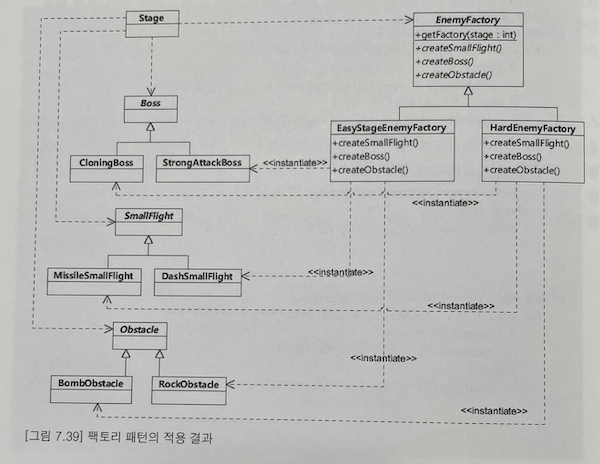

# 11 추상 팩토리 패턴 (Abstract Factory Pattern)

참고 : [추상 팩토리 패턴 (Abstract Factory Pattern)](https://johngrib.github.io/wiki/abstract-factory-pattern/)

서로 관련성이 있는 다양한 객체를 생성하기 위한 인터페이스를 제공한다

## GoF에서의 설명
> 상세화된 서브클래스를 정의하지 않고도 서로 관련성이 있거나 독립적인 여러 객체의 군을 생성하기 위한 인터페이스를 제공합니다.

추상 팩토리는 다음의 경우에 사용합니다.
- 객체가 생성되거나 구성, 표현되는 방식과 무관하게 시스템을 독립적으로 만들고자 할 때
- 여러 제품군 중 하나를 선택해서 시스템을 설정해야 하고 한번 구성한 제품을 다른 것으로 대체할 수 있을 때
- 관련된 제품 객체들이 함께 사용되도록 설계되었고, 이 부분에 대한 제약이 외부에도 지켜지도록 하고 싶을 때
- 제품에 대한 클래스 라이브러리를 제공하고, 그들의 구현이 아닌 인터페이스를 노출시키고 싶을 때

헤드 퍼스트에서의 설명
> 추상 팩토리 패턴을 사용하면 클라이언트에서 추상 인터페이스를 통해서 일련의 제품들을 공급받을 수 있습니다. 이때, 실제로 어떤 제품이 생산되는지는 전혀 알 필요도 없습니다. 따라서 클라이언트와 팩토리에서 생산되는 제품을 분리시킬 수 있습니다.

"실전 코드로 배우는 실용주의 디자인 패턴"에서는 다음과 같이 설명한다.5

> Abstract Factory는 **실제 객체가 정확히 무엇인지 알지 못해도 객체를 생성하고 조작**할 수 있도록 해준다(예제는 Iterator를 이용하는데, Iterator 인터페이스만 알면, 구현체는 몰라도 된다). 이런 방식으로 **Concrete Product를 사용하는 코드를 변경하지 않으면서도 손쉽게 새로운 Concrete Product를 추가할 수 있다**. Abstract Factory는 또한 다양한 환경에서 작동하는 코드를 쉽게 만들 수 있도록 해준다. 예를 들어 시스템은 각 환경에 맞는 고유한 Concrete Factory를 생성하고, 이는 다시 환경에 맞는 Concrete Product를 생성한다. 하지만 이들을 구현 클래스가 아닌 인터페이스를 통해 이용하기 때문에 여러분은 사용하고 있는 환경(혹은 Concrete Product)이 무엇인지 알지 못한다.

```
┌──────────────────────────┐         ┌────────────────────────┐
│ Collection <<interface>> │         │ Iterator <<interface>> │
╞══════════════════════════╡         ╞════════════════════════╡
│ +iterator(): Iterator    │         │ +hasNext(): boolean    │
└──────────────────────────┘         │ +next():    Object     │
 ∧     ∧                             │ +remove():  void       │
 │     │                             └────────────────────────┘
 │  ┌──┴────────────────────┐          ∧                     ∧
 │  │ LinkedList            │          │                     │
 │  ╞═══════════════════════╡creates ┌─┴──────────────────┐  │
 │  │ +iterator(): Iterator -------->│ LinkedListIterator │  │
 │  └───────────────────────┘        ╞════════════════════╡  │
 │                                   │ +hasNext(): boolean│  │
 │                                   │ +next():    Object │  │
 │                                   │ +remove():  void   │  │
 │                                   └────────────────────┘  │
 │  ┌───────────────────────┐                                │
 └──│ Tree                  │                                │
    ╞═══════════════════════╡creates ┌───────────────────────┴───┐
    │ +iterator(): Iterator -------->│ TreeIterator <<anonymous>>│
    └───────────────────────┘        ╞═══════════════════════════╡
                                     │ +hasNext(): boolean       │
                                     │ +next():    Object        │
                                     │ +remove():  void          │
                                     └───────────────────────────┘
```

## TDD

### 코딩 전 고민

factory 클래스에서 테스트로 보호할 것은 무엇인가
- 각 조건에 맞는 객체를 올바르게 리턴하는지 확인
  
#### factory는 테스트 과정에서 어떻게 관여할까?

SUT(테스트 대상)으로의 역할
- 원하는 구상 팩토리가 리턴되는지 확인
- 각 구상 팩토리가 조건에 맞는 객체를 올바르게 리턴하는지 확인

factory가 리턴하는 구상 클래스를 테스트하는 과정 혹은 이를 사용하는 Stage 클래스를 테스트 하는 과정에서의 협력 객체로서 동작
- Stage.createEnemies()를 테스트 하는 과정에서 enemyFactory의 createBoss()와 createSmallFlight() 등이 호출되는지 확인
  - 이건 별 의미가 없어 보인다. 리턴되는 객체와의 협력만 확인하면 될 것 
- 원하는 구상 팩토리가 리턴되는지 확인
  - 이것도 별 의미가 없어 보인다. 리턴되는 객체가 의도에 맞는지도 알 수 없다.
- Stage.createEnemies()에서 boss와 enemies가 생성되는지 확인
  - 이 과정에서 자연스럽게 factory는 검증될 것 같다. 그렇다면 여전히 factory는 별도로 테스트 코드를 추가해야 하나?
  - **Stage 클래스는 factory 클래스를 통해 Boss, Enemey, Obstacle 객체를 만든다는 요구 사항만 만족하면 된다.** Stage 클래스를 테스트할 때 어떤 레벨에서 어떤 Boss 객체가 나와야 한다는 것까지 테스트가 되어야 할까? 아니다. 이런 조건은 factory가 리턴할 객체를 각각 SUT로 테스트할 때 해소가 될 것 같다.  

Stage 클래스를 테스트할 때
- factory가 리턴하는 객체 중에 unit 테스트에서 사용하기 어려운 경우가 있다고 할 때, Stage 클래스가 factory의 static method로부터 객체를 생성한다면, 구상 클래스를 mock으로 대체하기 어렵다. 단순한 클래스가 아니라면 DI가 유리할 듯.

### 설계


- 그림 7.39 팩토리 패턴의 적용 결과
- Stage가 factory를 주입받도록 처리하기 때문에, 여기서 getFactory는 구현하지 않는다.

### 코딩
#### factory interface를 만든다
```java
public interface Boss {}
public interface SmallFlight {}
public interface Obstacle {}

public interface EnemyFactory {
  Boss createBoss();
  SmallFlight createSmallFlight();
  Obstacle createObstacle();
}
```

#### Stage를 사용하는 테스트를 만든다
- level과 easy stage enemy factory를 생성자로 넘겨서 Stage를 생성하고 boss, enemies, obstacles가 생성됐는지 확인

compile 오류가 없는 정도로 테스트 작성
```java
public class EasyStageEnemyFactory implements EnemyFactory {
  @Override
  public Boss createBoss() {
    return null;
  }

  @Override
  public SmallFlight createSmallFlight() {
    return null;
  }

  @Override
  public Obstacle createObstacle() {
    return null;
  }
}

public class Stage {
    Boss boss;
    List<Obstacle> obstacles = new ArrayList<>();
    List<SmallFlight> smallFlights = new ArrayList<>();

    public Stage(int level, EnemyFactory enemyFactory) {

    }

    public Boss getBoss() {
        return boss;
    }

    public List<Obstacle> getObstacles() {
        return obstacles;
    }

    public List<SmallFlight> getSmallFlights() {
        return smallFlights;
    }
}

class StageTest {
  @Test
  void Stage에_쉬운_레벨용_enemy들을_설정할_수_있다() {
    // Arrange
    int stageLevel = 1;
    var factory = new EasyStageEnemyFactory();
    Stage stage = new Stage(stageLevel, factory);

    // Act

    // Assert
    assertEquals("Stage : " + stageLevel, stage.getStageName());

    assertNotNull(stage.getBoss());
    assertTrue(stage.getSmallFlights().size() > 0);
    assertTrue(stage.getObstacles().size() > 0);
  }
}
```

테스트 실행
```
expected: not <null>
org.opentest4j.AssertionFailedError: expected: not <null>
```

Stage가 생성자에서 factory로부터 필요한 객체를 받을 수 있게 구현
```java
public class Stage {
  Boss boss;
  List<Obstacle> obstacles = new ArrayList<>();
  List<SmallFlight> smallFlights = new ArrayList<>();
  private final int level;
  private final EnemyFactory enemyFactory;

  public Stage(int level, EnemyFactory enemyFactory) {
    this.level = level;
    this.enemyFactory = enemyFactory;
    boss = enemyFactory.createBoss();
    createSmallFlights();
    createObstacles();
  }

  private void createObstacles() {
    for (int i = 0; i < 5; i++) {
      obstacles.add(enemyFactory.createObstacle());
    }
  }

  private void createSmallFlights() {
    for (int i = 0; i < 5; i++) {
      smallFlights.add(enemyFactory.createSmallFlight());
    }
  }
  
  // ...
}
```

테스트가 통과할 수 있게 EasyStageEnemyFactory의 상세 구현 
```java
public class EasyStageEnemyFactory implements EnemyFactory {
    @Override
    public Boss createBoss() {
        return new StrongAttackBoss();
    }

    @Override
    public SmallFlight createSmallFlight() {
        return new DashSmallFlight();
    }

    @Override
    public Obstacle createObstacle() {
        return new RockObstacle();
    }
}
```

새로운 요구 사항에 따라 어려운 레벨의 Stage 생성 테스트
- 바로 위 쉬운 레벨의 테스트를 복사한 후 factory 종류만 바꿔준다
- 생성된 boss, small flights, obstacles가 실제로 어려운 레벨인지 아닌지는 알 수 없다
```java
class StageTest {
    @Test
    void Stage에_어려운_레벨용_enemy들을_설정할_수_있다() {
        // Arrange
        int stageLevel = 2;
        var factory = new HardEnemyFactory();
        Stage stage = new Stage(stageLevel, factory);

        // Act

        // Assert
        assertEquals("Stage : " + stageLevel, stage.getStageName());

        assertNotNull(stage.getBoss());
        assertTrue(stage.getSmallFlights().size() > 0);
        assertTrue(stage.getObstacles().size() > 0);
    }
}
```

테스트를 통과하기 위해 HardEnemyFactory 구현
```java
public class HardEnemyFactory implements EnemyFactory {
    @Override
    public Boss createBoss() {
        return new CloningBoss();
    }

    @Override
    public SmallFlight createSmallFlight() {
        return new MissileSmallFlight();
    }

    @Override
    public Obstacle createObstacle() {
        return new BombObstacle();
    }
}
```

### 프로토타입 방식

factory가 생성하는 객체가 늘 동일한 상태를 갖는다면, 프로토타입 방식으로 구현할 수 있다.
- 뭐가 좋은지는 잘 모르겠다

```java
public class Factory {
  private ProductA productAProto;
  private ProductB productBProto;

  public Factory(ProductA productAProto, ProductB productBProto) {
    this.productAProto = productAProto;
    this.productBProto = productBProto;
  }

  public productA createA() {
      return (productA) productAProto.clone();
  }
  
  public productB createB() {
      return (productB) productBProto.clone();
  }
}
```

사용
```java
public class App {
  public static void main(String[] args) {
    Factory family1Factory = new Factory(new HighProductA(), new HighProductB());
    ProductA a = family1Factory.createA();
    
    Factory family2Factory = new Factory(new LowProductA(), new LowProductB());
    ProductB b = family2Factory.createB();
  }
}
```


